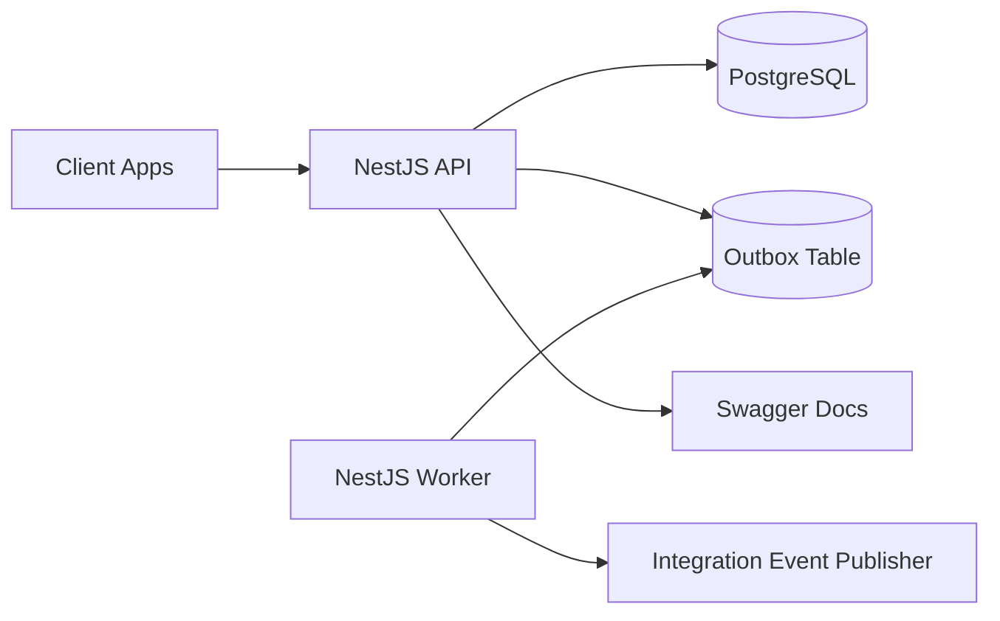
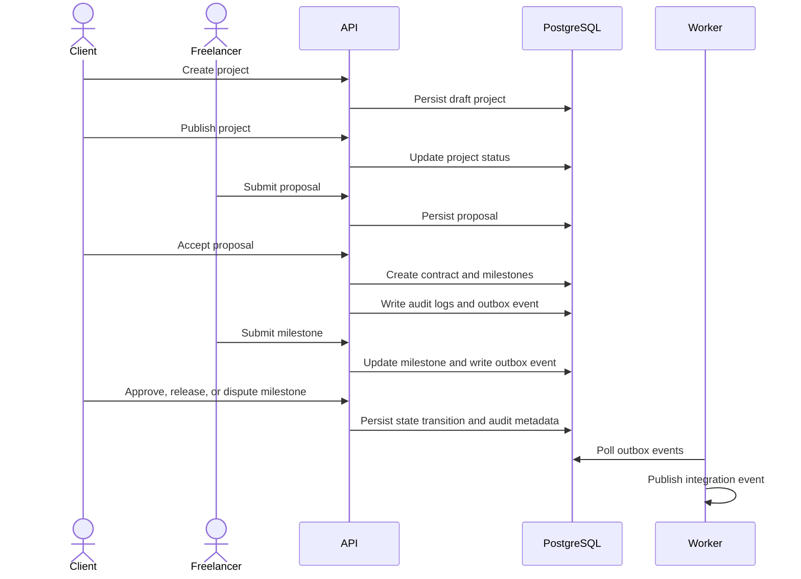

# Gigahub OS

Gigahub OS is a workflow-driven marketplace backend built with NestJS, PostgreSQL, Prisma, and a separate worker process. It models the core backend of a freelance marketplace with identity, projects, proposals, contracts, milestones, disputes, audit logs, dashboard metrics, and a transactional outbox relay.

The goal of this repository is to show a backend that is more than a CRUD API. It demonstrates clear module boundaries, explicit state transitions, transaction-safe event persistence, actor-scoped access control, and operational visibility.

## Project Highlights

* NestJS monorepo with separate API and worker applications
* Modular application structure with strong feature boundaries
* PostgreSQL-backed transactional outbox
* Worker process for asynchronous integration event relay
* JWT authentication and role-based authorization
* Client and freelancer marketplace workflows
* Project publishing and proposal submission
* Proposal acceptance with contract and milestone creation
* Milestone submit, approve, release, and dispute transitions
* Actor-scoped audit logs
* Actor dashboard metrics
* Optimistic concurrency for critical state changes
* Swagger documentation
* Structured request logging
* Health checks
* Prisma migrations and generated client isolation
* Docker Compose local infrastructure

## Tech Stack

* Node.js
* pnpm
* NestJS
* TypeScript
* PostgreSQL
* Prisma
* Docker Compose
* Swagger

## Repository Structure

```txt
apps
  api
    src
      bootstrap
      modules
  worker
    src
      modules
libs
  common
    src
      domain
      infrastructure
      interfaces
      shared
  contracts
    src
docs
  api-workflow.md
  architecture.md
  demo-flow.ps1
  operations.md
prisma
  schema.prisma
```

## Applications

### API

The API exposes versioned HTTP routes for marketplace workflows.

Main responsibilities:

* authentication
* authorization
* profile management
* project publishing
* proposal management
* contract creation
* milestone delivery
* dispute handling
* audit log browsing
* dashboard metrics
* health checks
* Swagger documentation

### Worker

The worker runs as a separate NestJS application context.

Main responsibilities:

* polling pending outbox events
* publishing integration events through an isolated publisher boundary
* marking relayed events with idempotent updates
* keeping async workloads outside API request latency

## Architecture Overview



## Main Workflow



## Core Concepts

### Modular Monorepo

The repository is structured as a NestJS monorepo with isolated applications and shared libraries. The API and worker are separate runtime boundaries, while common infrastructure and shared primitives live under `libs`.

### Workflow-Driven Design

The project focuses on real marketplace workflows instead of simple resource CRUD. Important user actions are represented as explicit state transitions with validation, authorization, audit logging, and integration event persistence.

### Transactional Outbox

Important state transitions write integration events into the outbox table inside the same database transaction as the business change.

The worker relays those events outside the API request lifecycle.

Current integration event names:

* `ContractCreated`
* `MilestoneSubmitted`
* `MilestoneApproved`
* `MilestoneReleased`
* `MilestoneDisputed`

### Actor-Scoped Access

Every protected workflow is scoped to the authenticated actor. Clients and freelancers only access resources they own or participate in.

### Optimistic Concurrency

Critical state changes use version-aware updates to protect workflows from conflicting concurrent requests.

Examples:

* publishing projects
* accepting proposals
* milestone submit, approve, release, and dispute transitions

## Marketplace Workflow

The main flow is:

1. A client registers or logs in.
2. A freelancer registers or logs in.
3. The client creates a draft project.
4. The client publishes the project.
5. The freelancer submits a proposal.
6. The client accepts the proposal.
7. The system creates a contract and milestones.
8. The freelancer submits a funded milestone.
9. The client approves and releases the milestone.
10. Either actor can dispute a funded, submitted, or approved milestone.
11. Important workflow transitions create audit logs and outbox events.
12. The worker relays pending outbox events.

## Core API Areas

### Identity

* register client or freelancer
* login
* receive access and refresh tokens

### Profiles

* upsert authenticated user profile
* keep user profile separate from identity credentials

### Projects

* create projects as a client
* publish projects
* browse available projects

### Proposals

* submit proposals as a freelancer
* withdraw submitted proposals
* accept proposals as the owning client

### Contracts

* create contracts by accepting proposals
* create milestones during proposal acceptance
* browse actor-scoped contracts

### Milestones

* submit funded milestones as a freelancer
* approve submitted milestones as a client
* release approved milestones as a client
* dispute funded, submitted, or approved milestones as either actor

### Audit Logs

* browse authenticated actor audit logs
* filter by action, resource type, and resource ID

### Dashboard

* view actor-scoped status counts
* view work queue metrics
* view financial metrics
* view recent activity

## Local Requirements

* Node.js 24+
* pnpm 10+
* Docker Desktop

## Environment

Create a local `.env` file from `.env.example`.

```powershell
Copy-Item .env.example .env
```

Use strong JWT secrets for local development as well.

## Start Infrastructure

```powershell
docker compose up -d postgres
```

Redis is included in Docker Compose for future queue-backed workflows, but it is not required by the current application flow.

When a queue-backed flow is added later:

```powershell
docker compose --profile queue up -d redis
```

## Install Dependencies

```powershell
pnpm install
```

## Generate Prisma Client

```powershell
pnpm prisma:generate
```

## Apply Database Migrations

For local development:

```powershell
pnpm prisma:migrate:dev
```

For applying existing migrations:

```powershell
pnpm prisma:migrate:deploy
```

## Verify the Project

```powershell
pnpm format
pnpm lint
pnpm build
```

## Run the API

```powershell
pnpm start:api
```

## Run the Worker

Open another terminal:

```powershell
pnpm start:worker
```

## Swagger

```powershell
Start-Process http://localhost:3000/docs
```

Use the complete bearer value in Swagger authorization:

```txt
Bearer ACCESS_TOKEN
```

## Health Checks

Live check:

```powershell
Invoke-RestMethod http://localhost:3000/api/v1/health/live
```

Ready check:

```powershell
Invoke-RestMethod http://localhost:3000/api/v1/health/ready
```

## Demo Flow

Run the API first:

```powershell
pnpm start:api
```

Run the worker in another terminal if you want to see outbox relay logs:

```powershell
pnpm start:worker
```

Then run:

```powershell
powershell -ExecutionPolicy Bypass -File docs/demo-flow.ps1
```

The demo script prints:

* client bearer token
* freelancer bearer token
* health check output
* created project ID
* created proposal ID
* created contract ID
* release milestone ID
* dispute milestone ID
* milestone states
* audit log output
* dashboard output
* Swagger authorization values

## Worker Relay Logs

When the worker is running, expected relay log event types include:

```txt
outbox_relay_started
outbox_relay_batch_loaded
integration_event_published
outbox_relay_event_processed
```

## Documentation

Detailed docs are available in:

* `docs/architecture.md`
* `docs/api-workflow.md`
* `docs/operations.md`

## Generated Files

The Prisma client is generated under the common database library path.

Do not commit generated output.

Before committing after a generate command:

```powershell
git reset libs/common/src/infrastructure/database/generated
```

## Useful Commands

Start PostgreSQL:

```powershell
docker compose up -d postgres
```

Generate Prisma client:

```powershell
pnpm prisma:generate
```

Run migrations locally:

```powershell
pnpm prisma:migrate:dev
```

Format, lint, and build:

```powershell
pnpm format
pnpm lint
pnpm build
```

Run API:

```powershell
pnpm start:api
```

Run worker:

```powershell
pnpm start:worker
```

Run demo:

```powershell
powershell -ExecutionPolicy Bypass -File docs/demo-flow.ps1
```

## Suggested Local Verification Sequence

Terminal 1:

```powershell
docker compose up -d postgres
pnpm prisma:generate
pnpm format
pnpm lint
pnpm build
pnpm start:api
```

Terminal 2:

```powershell
pnpm start:worker
```

Terminal 3:

```powershell
powershell -ExecutionPolicy Bypass -File docs/demo-flow.ps1
```

## 📬 Contact Us

We'd love to hear from you! If you have questions, suggestions, or need support, here are the ways to reach us:

**Website:** [dyniqo.dev](https://dyniqo.dev)
**Email:** [contact@dyniqo.dev](mailto:contact@dyniqo.dev)
**GitHub Issues:** [Open an Issue](https://github.com/dyniqo/gigahub-os/issues)

We look forward to hearing from you!
