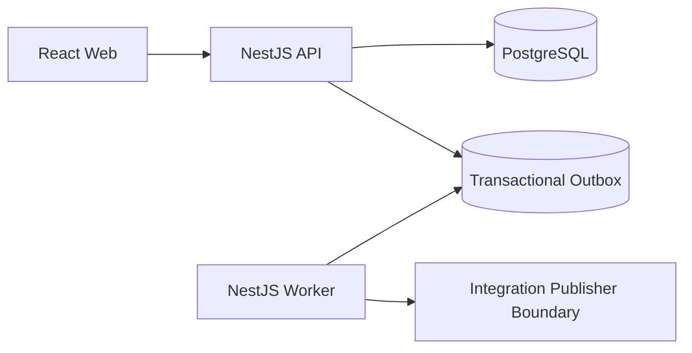

# GigaHub OS

GigaHub OS is a workflow-driven freelance marketplace built with NestJS, React, PostgreSQL, Prisma, and a separate worker process. It covers project discovery, proposal submission, contract creation, milestone delivery, disputes, audit logs, dashboard metrics, and PostgreSQL-backed asynchronous outbox relay.

## Stack

- Node.js 24, pnpm 10, TypeScript
- NestJS API and worker applications
- React, Vite, Tailwind CSS web application
- PostgreSQL and Prisma migrations
- Docker Compose for the full local stack
- Swagger API documentation and health checks

## Applications

```txt
apps/api       NestJS HTTP API
apps/worker    NestJS worker for outbox relay
apps/web       React/Vite web workspace
libs/common    Shared backend domain and infrastructure
libs/contracts Shared contracts and DTOs
prisma         Prisma schema and migrations
docs           Operational and workflow notes
```

## Requirements

For the one-command Docker setup, only these are required:

- Git
- Docker and Docker Compose

Local Node.js, pnpm, and `node_modules` are not required for Docker. Dependencies are installed inside the Docker image.

For host-based development without Dockerized app containers, use:

- Node.js `24.x`
- pnpm `10.x`

Enable the pinned pnpm version once per machine when using local development commands:

```bash
corepack enable
corepack prepare pnpm@10.0.0 --activate
```

## Start Everything with Docker

Fresh clone:

```bash
git clone https://github.com/dyniqo/gigahub-os.git
cd gigahub-os
cp .env.example .env
cp apps/web/.env.example apps/web/.env
docker compose up --build
```

If you skip the `.env` files, Docker Compose still uses safe local defaults from `docker-compose.yml`. Copying the examples is recommended when you want to customize ports, CORS, or local secrets.

Detached mode:

```bash
docker compose up -d --build
docker compose logs -f migrate api worker web
```

Open:

```txt
Web:     http://localhost:8080
API:     http://localhost:3000/api/v1
Swagger: http://localhost:3000/docs
```

Health checks:

```bash
curl http://localhost:3000/api/v1/health/live
curl http://localhost:3000/api/v1/health/ready
```

Stop the stack:

```bash
docker compose down
```

Reset local Docker data only when you intentionally want to delete the local PostgreSQL volume:

```bash
docker compose down -v
```

## Database and Migration Safety

The Docker stack uses its own PostgreSQL container and a named Docker volume. It does not connect to a PostgreSQL database already running on your machine.

On startup, the `migrate` service runs:

```bash
pnpm prisma:migrate:deploy
```

This applies committed migrations only. It does not run `prisma migrate dev`, does not reset the database, and does not drop local data. If the target database is not compatible with the committed Prisma migration history, startup fails before the API and worker start.

The PostgreSQL container is exposed on host port `55432` by default to avoid common conflicts with an existing local PostgreSQL server on `5432`.

## Local Development without Dockerized App Containers

Create local environment files:

```bash
cp .env.example .env
cp apps/web/.env.example apps/web/.env
```

Start PostgreSQL only:

```bash
docker compose up -d postgres
```

Install and prepare the project:

```bash
pnpm install --frozen-lockfile
pnpm prisma:generate
pnpm prisma:migrate:dev
```

Run the apps in separate terminals:

```bash
pnpm start:api:dev
pnpm start:worker:dev
pnpm dev:web
```

Local development URLs:

```txt
Web:     http://localhost:5173
API:     http://localhost:3000/api/v1
Swagger: http://localhost:3000/docs
```

## Pull, Install, Verify, Build

After pulling new changes:

```bash
corepack enable
corepack prepare pnpm@10.0.0 --activate
pnpm install --frozen-lockfile
pnpm prisma:generate
pnpm verify
```

`pnpm verify` runs formatting checks, linting, web type-checking, and a full production build.

Individual commands:

```bash
pnpm format:check
pnpm lint
pnpm typecheck:web
pnpm build
```

## Demo Flow

After the API is running:

```powershell
powershell -ExecutionPolicy Bypass -File docs/demo-flow.ps1
```

The script uses `http://localhost:3000/api/v1` by default. Override it with:

```powershell
$env:GIGAHUB_API_BASE_URL = "http://localhost:3000/api/v1"
powershell -ExecutionPolicy Bypass -File docs/demo-flow.ps1
```

## Useful Commands

```bash
pnpm docker:up           # docker compose up --build
pnpm docker:up:detached  # docker compose up -d --build
pnpm docker:logs         # follow migrate/api/worker/web logs
pnpm docker:down         # stop containers, keep data
pnpm docker:reset        # stop containers and delete local Docker DB volume
```

Make targets are also available:

```bash
make install
make verify
make infra
make app
make app-logs
make app-down
```

## Architecture Summary



Important workflow transitions write integration events to the outbox table inside the same database transaction as the business change. The worker relays pending events outside API request latency. Redis is not required because the current async workflow is PostgreSQL-backed outbox polling.

## Production Deployment

For production, do not copy `node_modules` or build the app directly on the VPS. The recommended flow is to build Docker images in GitHub Actions, publish them to GitHub Container Registry, and let the VPS pull those images with `docker-compose.prod.yml`.

Production VPS instructions are documented in [docs/deployment-vps.md](docs/deployment-vps.md).

## More Docs

- [Operations](docs/operations.md) - operational commands and safety notes
- [VPS Deployment](docs/deployment-vps.md) - production VPS deployment guide
- [Architecture](docs/architecture.md) - architecture and module boundaries
- [API Workflow](docs/api-workflow.md) - API workflow guide

## Contact Us

We'd love to hear from you! If you have questions, suggestions, or need support, here are the ways to reach us:

**Website:** [dyniqo.dev](https://dyniqo.dev)
**Email:** [contact@dyniqo.dev](mailto:contact@dyniqo.dev)
**GitHub Issues:** [Open an Issue](https://github.com/dyniqo/gigahub-os/issues)

We look forward to hearing from you!
