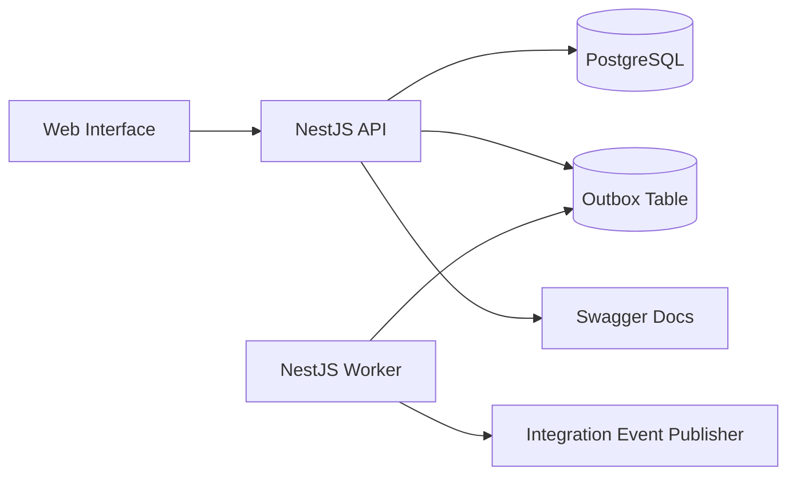

# GigaHub OS Architecture

GigaHub OS is a workflow-driven freelance marketplace system for project discovery, proposal submission, contract creation, milestone delivery, dispute handling, auditability, dashboard metrics, and asynchronous event relay.

The codebase is organized as a monorepo with separate API, web, and worker applications. The API owns synchronous HTTP workflows. The web application provides the connected user interface. The worker owns asynchronous relay behavior for integration events persisted through the transactional outbox.

## Architectural Goals

The project is shaped around a few core goals:

- Keep business workflows explicit and easy to review.
- Keep module boundaries strong enough to evolve toward independently deployable services later.
- Persist business changes and integration events in the same database transaction.
- Keep APIs observable through structured request logs, audit logs, health checks, and dashboard metrics.
- Keep authentication, authorization, validation, throttling, and error responses consistent across the API.
- Keep the web interface connected to the same workflow model exposed by the API.
- Keep public discovery, authenticated workspaces, and actor-scoped operations separated clearly in the UI.

## Applications

### API

The API application exposes HTTP endpoints under a versioned route prefix.

Responsibilities:

- Identity and access flows
- Profile management
- Project creation, publishing, discovery, and ownership
- Proposal submission, withdrawal, review, and acceptance
- Proposal acceptance and contract creation
- Milestone submit, approve, release, and dispute transitions
- Actor-scoped audit log browsing
- Actor dashboard metrics
- Swagger documentation
- Health checks
- Request logging and response shaping

### Web

The web application is the React, Vite, and Tailwind interface for GigaHub OS.

Responsibilities:

- Public landing page
- Project exploration and project detail views
- Authentication screens
- Role-aware workspace navigation
- Profile editing and live profile preview
- Client project creation and management
- Freelancer proposal submission and management
- Client proposal review and acceptance
- Contract and milestone panels
- Dashboard overview
- Audit log browsing
- Service health panel
- Light and dark theme support
- Static brand assets for favicon and profile placeholders

The web application reads the API base URL from `VITE_API_BASE_URL` and uses a centralized API client layer for authenticated and unauthenticated requests.

### Worker

The worker application runs as a separate NestJS application context.

Responsibilities:

- Poll unprocessed outbox events
- Publish integration event logs through a publisher abstraction
- Mark events as processed through an idempotent attempt-based update
- Keep relay execution independent from API request latency

The current publisher logs integration events. The publisher boundary is intentionally isolated so it can later be replaced with a broker-backed implementation without changing business modules.

## Module Boundaries

The API is divided into feature modules:

- `identity`
- `users`
- `profiles`
- `projects`
- `proposals`
- `contracts`
- `milestones`
- `audit-log`
- `dashboard`
- `outbox`
- `health`

Each feature owns its HTTP layer, DTOs, presenters, services, and local domain concepts where needed.

The web application is divided into UI and client-side workflow areas:

- `components`
- `data`
- `hooks`
- `lib`
- `pages`
- `types`

Cross-cutting backend concerns live in shared libraries:

- configuration
- database access
- domain base classes
- pagination helpers
- request logging
- exception filtering
- response interception

## Repository Boundaries

```txt
apps
  api
    src
      bootstrap
      modules
  web
    public
    src
      components
      data
      hooks
      lib
      pages
      types
  worker
    src
      modules
libs
  common
    src
      domain
      infrastructure
      interfaces
      shared
  contracts
    src
docs
  api-workflow.md
  architecture.md
  demo-flow.ps1
  operations.md
prisma
  schema.prisma
```

## Workflow Overview

The main marketplace workflow is:

1. A client creates a project.
2. The client publishes the project.
3. A freelancer discovers the project.
4. The freelancer submits a proposal.
5. The client reviews and accepts the proposal.
6. A contract is created with funded milestones.
7. The freelancer submits milestone work.
8. The client approves and releases a milestone.
9. Either actor can open a milestone dispute before release.
10. Every important transition writes an audit log.
11. Every integration-worthy transition writes an outbox event.
12. The worker relays pending outbox events.

## Runtime Flow



## Consistency Model

Business writes that must stay consistent are wrapped in database transactions.

Examples:

- Accepting a proposal updates the proposal, closes competing proposals, updates the project, creates the contract, creates milestones, records audit logs, and records an outbox event.
- Milestone transitions update the milestone, record audit logs, and record outbox events.
- Releasing the final milestone completes the contract inside the same workflow.

Optimistic concurrency is handled with version checks on state-changing writes.

## Transactional Outbox

The outbox pattern is used to avoid losing integration events when business state changes successfully.

The API writes outbox rows inside the same transaction as the business change.

The worker later reads pending events and publishes them through `OutboxEventPublisher`.

Current event names include:

- `ContractCreated`
- `MilestoneSubmitted`
- `MilestoneApproved`
- `MilestoneReleased`
- `MilestoneDisputed`

## Security Model

The API uses JWT authentication and role-based authorization.

Main actor roles:

- `CLIENT`
- `FREELANCER`

Security controls include:

- validated environment variables
- password hashing
- bearer-token authentication
- route-level role guards
- request body validation
- throttling
- secure response shaping
- consistent exception filtering
- actor-scoped data access checks
- audit trails for sensitive transitions

The web application keeps access and refresh token handling separated in its client-side session flow and sends authenticated requests through the configured API base URL.

## Observability

The system exposes multiple layers of visibility:

- structured request logs
- consistent request IDs
- health checks
- audit logs
- actor dashboards
- worker relay logs
- Swagger documentation
- web health panel

The dashboard is intentionally actor-scoped. It gives each authenticated user a safe summary of project, proposal, contract, milestone, financial, queue, and recent activity state.

## Runtime Dependencies

Local runtime dependencies:

- PostgreSQL
- Node.js
- pnpm

Redis is represented in Docker Compose for queue-backed workflows. The current event relay uses PostgreSQL-backed outbox polling.

## Evolution Path

The current structure is a modular monolith with a separate worker process and a separate web interface.

The natural evolution path is:

1. Keep modules inside the same repository while workflows are still changing.
2. Keep the web application aligned with the API workflow model.
3. Replace the current outbox publisher with a broker-backed publisher.
4. Move high-throughput consumers behind the worker boundary.
5. Split modules with clear ownership into separate services only when operational pressure justifies it.
